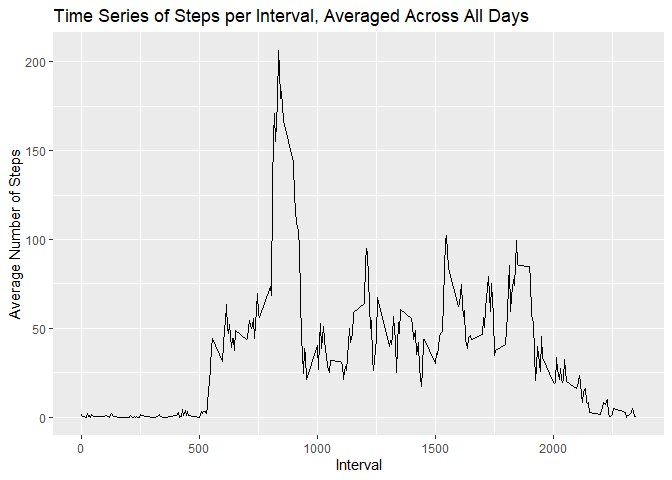
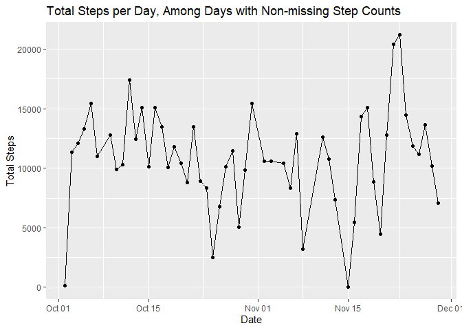

#### This document contains an analysis of data from the personal activity monitor of one individual during Oct and Nov 2012. Step counts taken at 5 minute intervals during this time frame are included in the raw data. The raw data contains three variables: date, interval number, and step count.    
  
    
First, read in the raw data, load required packages, and perform preliminary summary of the data. Convert date variable to date format.

```r
unzip("./activity.zip")
raw_data <- read.csv("activity.csv")
```


```r
library(ggplot2)
library(dplyr)
library(scales)
library(lattice)
library(knitr)
```


```r
str(raw_data)
```

```
## 'data.frame':	17568 obs. of  3 variables:
##  $ steps   : int  NA NA NA NA NA NA NA NA NA NA ...
##  $ date    : chr  "2012-10-01" "2012-10-01" "2012-10-01" "2012-10-01" ...
##  $ interval: int  0 5 10 15 20 25 30 35 40 45 ...
```

```r
summary(raw_data)
```

```
##      steps            date              interval     
##  Min.   :  0.00   Length:17568       Min.   :   0.0  
##  1st Qu.:  0.00   Class :character   1st Qu.: 588.8  
##  Median :  0.00   Mode  :character   Median :1177.5  
##  Mean   : 37.38                      Mean   :1177.5  
##  3rd Qu.: 12.00                      3rd Qu.:1766.2  
##  Max.   :806.00                      Max.   :2355.0  
##  NA's   :2304
```

```r
raw_data$date <- as.Date(raw_data$date, "%Y-%m-%d")
```

### **Steps per day**  
Ignoring missing step values for now, we calculate the total number of steps taken per day and plot the distribution as a histogram.

```r
steps_per_day <- subset(raw_data, !is.na(steps), select =  c("date", "steps")) %>% group_by(date) %>%     summarize(total_steps = sum(steps))
ggplot(steps_per_day, aes(total_steps)) + geom_histogram(binwidth = 2000) + labs(x = "Total Number of Steps per Day", y = "Count", title = "Histogram of Total Number of Steps per Day") + scale_x_continuous(label = comma)
```

<!-- -->

We observe a mean value of 10766.19 steps per day and a median value of 10765 steps per day.   
  
### **Average daily activity pattern**    
Next, we investigate the average number of steps per 5 minute interval, averaged across all 61 days in the observation period. Missing step values are again ignored.

```r
steps_per_interval <- subset(raw_data, !is.na(steps), select = c("interval", "steps")) %>% group_by(interval) %>% summarize(avg_steps = mean(steps))
ggplot(steps_per_interval, aes(interval, avg_steps)) + geom_line() + labs(x = "Interval", y = "Average Number of Steps", title = "Time Series of Steps per Interval, Averaged Across All Days")
```

<!-- -->

```r
max_step_index <- which.max(steps_per_interval$avg_steps)
```
On average, across all days in the raw data, interval number 835 has the maximum number of steps

### **Imputing missing values**  
Investigate the prevalence of missing step values and determine if they are concentrated in a particular interval or on a particular date. Determine what the distribution of steps looks like across intervals and dates.

```r
missing_steps <- subset(raw_data, is.na(steps))
nonmissing_steps <- subset(raw_data, !is.na(steps))

table(raw_data$date) #number of obs per date in raw data
```

```
## 
## 2012-10-01 2012-10-02 2012-10-03 2012-10-04 2012-10-05 2012-10-06 2012-10-07 
##        288        288        288        288        288        288        288 
## 2012-10-08 2012-10-09 2012-10-10 2012-10-11 2012-10-12 2012-10-13 2012-10-14 
##        288        288        288        288        288        288        288 
## 2012-10-15 2012-10-16 2012-10-17 2012-10-18 2012-10-19 2012-10-20 2012-10-21 
##        288        288        288        288        288        288        288 
## 2012-10-22 2012-10-23 2012-10-24 2012-10-25 2012-10-26 2012-10-27 2012-10-28 
##        288        288        288        288        288        288        288 
## 2012-10-29 2012-10-30 2012-10-31 2012-11-01 2012-11-02 2012-11-03 2012-11-04 
##        288        288        288        288        288        288        288 
## 2012-11-05 2012-11-06 2012-11-07 2012-11-08 2012-11-09 2012-11-10 2012-11-11 
##        288        288        288        288        288        288        288 
## 2012-11-12 2012-11-13 2012-11-14 2012-11-15 2012-11-16 2012-11-17 2012-11-18 
##        288        288        288        288        288        288        288 
## 2012-11-19 2012-11-20 2012-11-21 2012-11-22 2012-11-23 2012-11-24 2012-11-25 
##        288        288        288        288        288        288        288 
## 2012-11-26 2012-11-27 2012-11-28 2012-11-29 2012-11-30 
##        288        288        288        288        288
```

```r
table(missing_steps$date) #number of obs per date in data where steps are NA
```

```
## 
## 2012-10-01 2012-10-08 2012-11-01 2012-11-04 2012-11-09 2012-11-10 2012-11-14 
##        288        288        288        288        288        288        288 
## 2012-11-30 
##        288
```
  
    
Of the 17568 observations in the raw data, 2304 (13.1%) are missing step counts. The missing step counts occur on 8 specific dates. For those 8 dates, no step counts were recorded within any of the 288 intervals. All other dates have step counts recorded for all intervals.  
  


```r
ggplot(nonmissing_steps, aes(interval, steps)) + geom_point(aes(color = date), alpha = 0.3) + labs(title = "Step counts across interval numbers, stratified by date")
```

<!-- -->

```r
ggplot(steps_per_day, aes(date, total_steps)) + geom_point() + geom_line() + labs(x="Date", y="Total Steps", title = "Total Steps per Day, Among Days with Non-missing Step Counts")
```

<!-- -->
    
There are clear trends in step counts by interval number. Lower step counts are observed prior to interval 500 and after interval 2000. No obvious trend in step counts by date is observed (e.g., higher step counts do not correspond to earlier or later dates in the observation period.)  

Values for any missing step counts will be imputed using the average number of steps observed within the corresponding interval number. We will then plot the total number of steps per day after performing the imputation.

```r
imputed_data <- merge(raw_data, steps_per_interval, by = "interval") %>% mutate(new_steps = steps %>% is.na() %>% ifelse(avg_steps, steps))

imp_steps_per_day <- imputed_data %>% select(c("date", "new_steps")) %>% group_by(date) %>% summarize(total_steps = sum(new_steps))
ggplot(imp_steps_per_day, aes(total_steps)) + geom_histogram(binwidth = 2000) + labs(x = "Total Number of Steps per Day", y = "Count", title = "Histogram of Total Number of Steps per Day, with Imputed Data") + scale_x_continuous(label = comma)
```

<!-- -->
  
We observe a mean value of 10766.19 steps per day and a median value of 10766.19 steps per day when including imputed data.  

After imputation, the mean value of steps per day is identical to the mean value calculated prior to imputation. This is because the missing step values were concentrated on specific dates and were uniformly distributed across intervals, and because the imputation method used replaced missing values with the mean step count observed within a given interval. The median value of steps per day is slightly lower after imputation than it was before imputation.  
  
      
### **Activity Levels on Weekends and Weekdays**   
  
Finally, investigate whether the average number of steps taken per interval varies by weekdays versus weekend days, using imputed data


```r
weekend_list <- c("Saturday", "Sunday")
imputed_data_w_day_of_wk <- imputed_data %>% mutate(day_of_week = weekdays(date), day_of_week_cat = factor(day_of_week %in% weekend_list, levels = c("FALSE", "TRUE"), labels = c("weekday", "weekend")))

imp_steps_per_interval_w_day_of_wk <- imputed_data_w_day_of_wk[,c("interval", "day_of_week_cat", "new_steps")] %>% group_by(interval, day_of_week_cat) %>% summarize(avg_steps = mean(new_steps))

ggplot(imp_steps_per_interval_w_day_of_wk, aes(interval, avg_steps)) + geom_line(color = "steelblue") + facet_grid(day_of_week_cat ~.) + labs(x = "Interval", y = "Average Number of Steps", title = "Time Series of Steps per Interval, Averaged Across Weekdays and Weekends")
```

<!-- -->
  
We observe that increased step counts occur earlier in the day on weekdays, while step counts are more elevated in the middle portion of the day on weekends.
